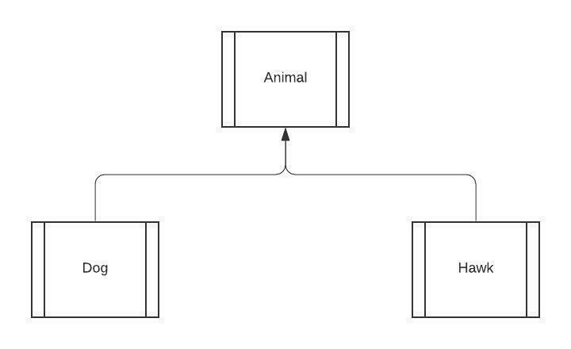
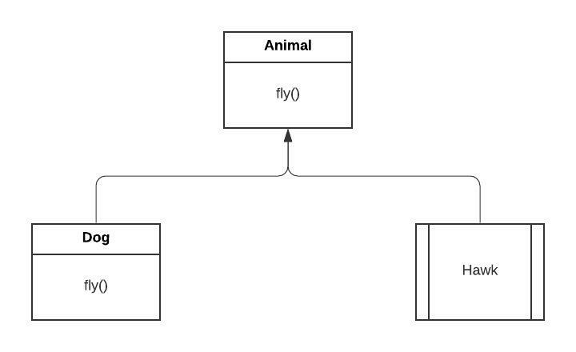
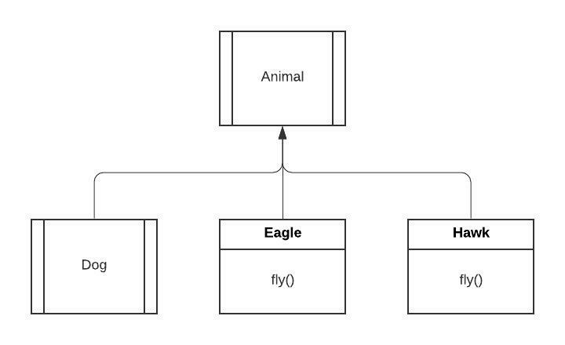
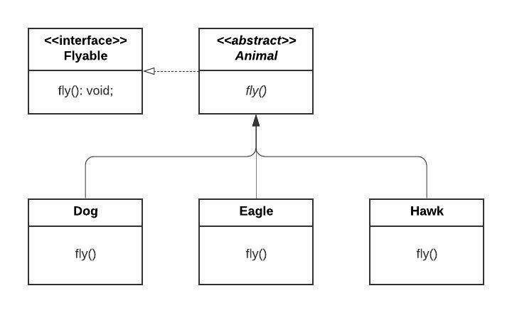
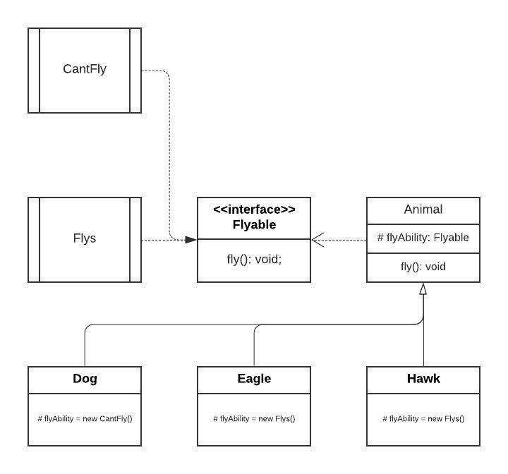

# Animal Behavior



```typescript
class Animal {}

class Dog extends Animal {}

class Hawk extends Animal {}
```

We are given the requirement to extend the functionality of certain generalizations of
the animal class to have the ability to fly.

###### Poor Solution #1

* implement the fly method in the superclass
* override the subclass to do nothing



```typescript
class Animal {
    fly(): void {
        // stretch
        // flap wing up
        // flap wing down
    }
}

class Dog extends Animal {
    fly(): void {/* override to jump */}
}

class Hawk extends Animal {}
```

You *__DO NOT__* want to add an algorithm to a superclass that does not
pertain to a subclass

###### Poor Solution #2

* Just add the methods to the classes that require the functionality



```typescript
class Animal {}

class Dog extends Animal {}

class Eagle extends Animal {
    fly(): void {
        // stretch
        // flap wing up
        // flap wing down
    }
}

class Hawk extends Animal {
    fly(): void {
        // stretch
        // flap wing up
        // flap wing down
    }
}
```

You *__DO NOT__* want to duplicate an algorithm across subclasses

###### Poor Solution #3

* Create an interface that forces an action



```typescript
interface Flyable {
    fly(): void;
}

abstract class Animal implements Flyable {
    abstract fly(): void;
}

class Dog extends Animal {
    fly(): void {
        // jump
    }
}

class Eagle extends Animal {
    fly(): void  {
        // stretch
        // flap wing up
        // flap wing down
    }
}

class Hawk extends Animal {
    fly(): void  {
        // stretch
        // flap wing up
        // flap wing down
    }
}
```

This creates the same problem found in *__Poor  Solution #2__*

###### Requirements Recapped

* *__Some__* classes should have fly
* Classes that don't fly shouldn't have to override the functionality  
* No duplicated algorithms

###### Strategy Solution



```typescript
interface Flyable {
    fly(): void;
}

class Flys implements Flyable {
    fly(): void {
        // stretch
        // flap wing up
        // flap wing down
    }
}

class CantFly implements Flyable {
    fly(): void {
        // jump
    }
}

class Animal {
    protected flyAbility: Flyable;
}

class Dog extends Animal {
    protected flyAbility = new CantFly();
}

class Hawk extends Animal {
    protected flyAbility = new Flys();
}
```